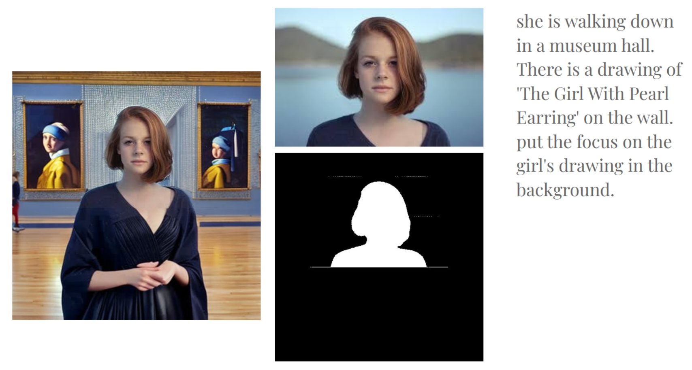
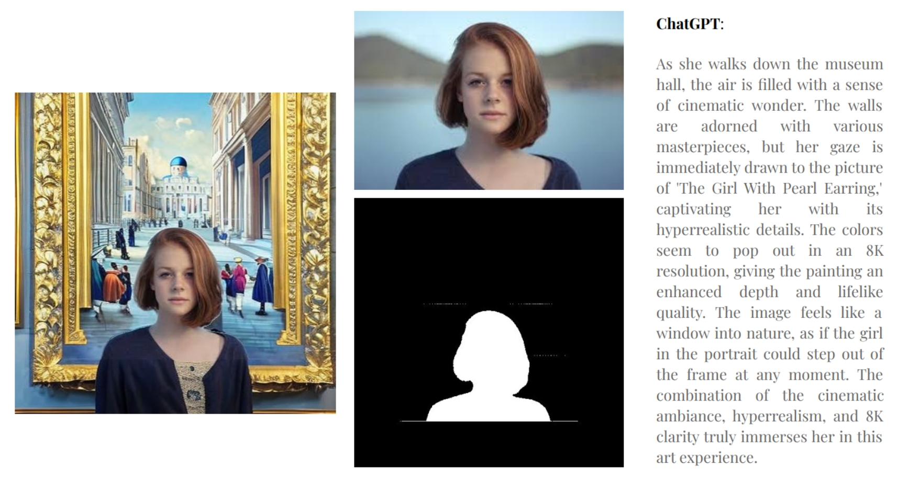
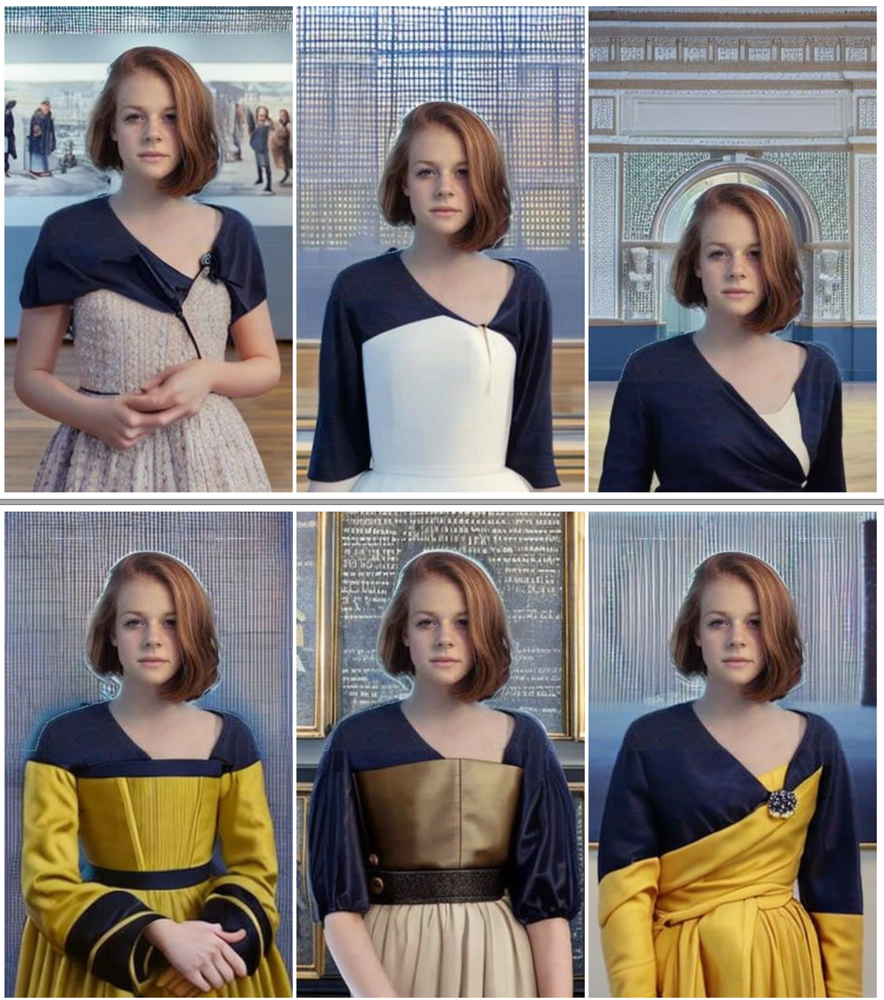

# Photo Lure

Discover your background with SAM (Segment Anything) and seamlessly replace it with a vast background using your desired prompt and other configurable settings through a stable diffusion model, or DALLE.

*The right image is the original picture; the left image is generated by Photo Lure by the user's prompt.*

*The right image is the original picture; the left image is generated by Photo Lure by the ChatGPT's prompt.*

*Moving the image up, and Photo Lure generates the rest!*

## Usage

Simply provide your image and, give a prompt, specify the model for generating your desired background. upwards your photo using the "up" feature. Guidance_scale is a parameter specifically designed for stable diffusion models, with a default value of 7.5.

If you want to use DALLE or ChatGPT, modify the API key in the src file.
